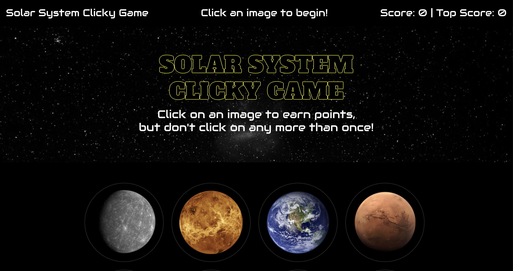

<h1> Clicky Game</h1>

This is a memory game built with React. It provides 12 different images and user will guess to click each image only once. When users click an image, image components are randomly shuffled and users will be notified if they guessed correctly or not each time they click an image. Users will also see their current score points and highest score for the current session will be saved and displayed.

 

## Technology
React and Bootstrap

## Link to deployed site
<a href="https://warm-waters-01857.herokuapp.com/">Solar System Clicky Game</a>